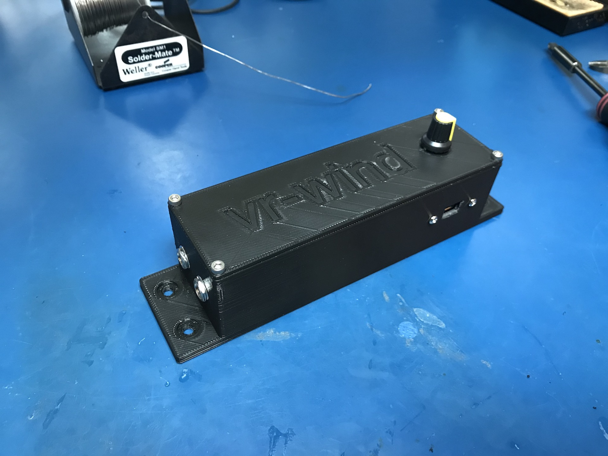
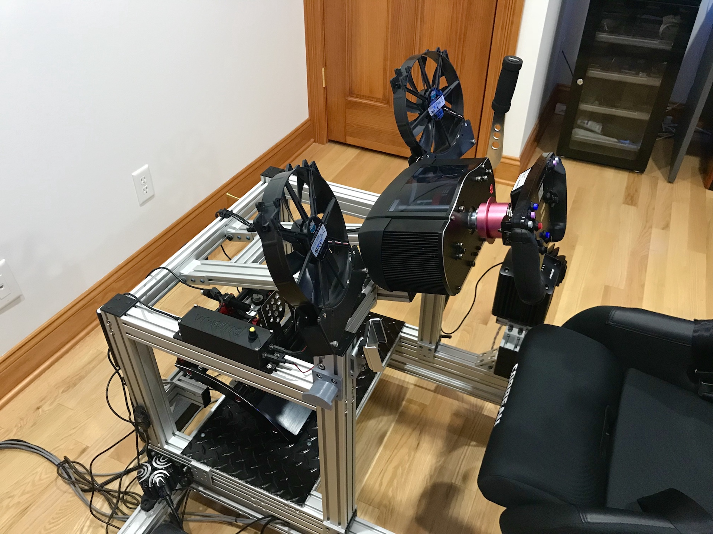
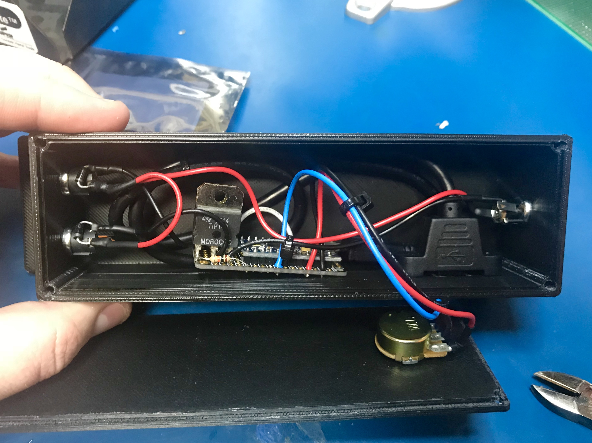

# vr-wind
Arduino based DIY Wind implementation for Assetto Corsa &amp; other games.

## 3D printable parts
In the [stl](stl/) directory are the stl files for the enclosure and the fan mounts. 
You should may need a large format 3D printer to print some of these parts.

## Arduino controller

The Arduino code [here](arduino/vr-wind/) is designed to work on an Arduino Pro Micro 5v, 
using pins 9 &amp; 10 for PWM output through some sort of darlington transistor solution. 

I used a pair of TIP142s that I already had. The wiring is very simple. Use a 1k (or so) current limiting resistor to the transistor emitter, 
shared ground (negative) to your 12v or 24v supply, and the collector of the transistor goes to the negative input of your motor. 
Positive on the motor goes directly to the positive supply.
You MUST include a backflow preventing diode across your motor. 

You can read more about this configuration [here](http://www.instructables.com/id/Use-Arduino-with-TIP120-transistor-to-control-moto/).

## Game plugins

* [Assetto Corsa](plugins/Assetto%20Corsa)
